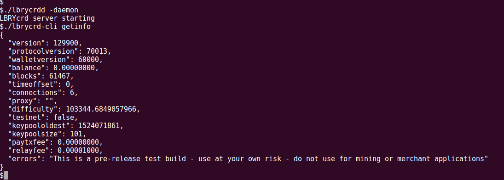

# LBRYcrd - The LBRY blockchain



LBRYcrd uses a blockchain similar to bitcoin's to implement an index and payment system for content on the LBRY network. It is a fork of bitcoin core.

## Installation

Latest binaries are available from https://github.com/lbryio/lbrycrd/releases. There is no installation procedure, the binaries run as is.

## Usage

The `lbrycrdd` executable will start a LBRYcrd node and connect you to the LBRYcrd network. Use the `lbrycrd-cli` executable
to interact with lbrycrdd through the command line. Help pages for both executable are available through
the "--help" flag (e.g. `lbrycrd-cli --help`).

### Example Usage

Run `./lbrycrdd -server -daemon` to start lbrycrdd in the background.

Run `./lbrycrd-cli getinfo` to check for some basic informations about your LBRYcrd node.

Run `./lbrycrd-cli help` to get a list of all commands that you can run. To get help on specific commands run `./lbrycrd-cli [command_name] help`

### Data directory

Lbrycrdd will use the below default data directories

Windows < Vista: C:\Documents and Settings\Username\Application Data\lbrycrd

Windows >= Vista: C:\Users\Username\AppData\Roaming\lbrycrd

Mac: ~/Library/Application Support/lbrycrd

Unix: ~/.lbrycrd

The data directory contains various things such as your default wallet (wallet.dat), debug logs (debug.log), and blockchain data. You can optionally
create a configuration file lbrycrd.conf in the default data directory which will be used by default when running lbrycrdd.
For a list of configuration parameters run `./lbrycrdd --help`. Below is a sample lbrycrd.conf to enable JSON RPC server on lbrycrdd.

```rpcuser=lbry
rpcpassword=xyz123456790
daemon=1
server=1
txindex=1
```

## Running from Source

Run `./reproducible_build.sh -c -t`. This will build the binaries and put them into the `./src` directory.

If you have any errors while processing , please check `doc/build-*.md` for further instructions. If you're still stuck, [create an issue](https://github.com/lbryio/lbrycrd/issues/new) with the output of that command, your system info, and any other information you think might be helpful.

## Contributing

Contributions to this project are welcome, encouraged, and compensated. For more details, see [lbry.io/faq/contributing](https://lbry.io/faq/contributing)

The codebase is in C++03, C++11 is currently not supported but we will be migrating to it in the near future. Recommended GCC version is 4.8 or greater.
We follow the same coding guidelines as documented by Bitcoin Core, see [here](/doc/developer-notes.md). To run an automated code formatting check, try:
`git diff -U0 master -- '*.h' '*.cpp' | ./contrib/devtools/clang-format-diff.py -p1`. This will check any commits not on master for proper code formatting.
We try to avoid altering parts of the code that is inherited from Bitcoin Core unless absolutely necessary. This will make it easier to merge changes from
Bitcoin Core. If commits are expected not to be merged upstream (i.e. we broke up a commit from Bitcoin Core in order to use a single feature in it), the commit
message must contain the string "NOT FOR UPSTREAM MERGE".

The `master` branch is regularly built and tested, but is not guaranteed to be
completely stable. [Releases](https://github.com/lbryio/lbrycrd/releases) are created
regularly to indicate new official, stable release versions.

Testing and code review is the bottleneck for development; we get more pull
requests than we can review and test on short notice. Please be patient and help out by testing
other people's pull requests, and remember this is a security-critical project where any mistake might cost people
lots of money. Developers are strongly encouraged to write [unit tests](/doc/unit-tests.md) for new code, and to
submit new unit tests for old code. Unit tests can be compiled and run
(assuming they weren't disabled in configure) with: `make check`

The Travis CI system makes sure that every pull request is built, and that unit and sanity tests are automatically run.

### Testnet

Testnet is maintained for testing purposes and can be accessed using the command `./lbrycrdd -testnet`. If you would like testnet credits, please contact kay@lbry.io or grin@lbry.io.

## License

This project is MIT licensed. For the full license, see [LICENSE](LICENSE).

## Security

We take security seriously. Please contact security@lbry.io regarding any security issues.
Our PGP key is [here](https://keybase.io/lbry/key.asc) if you need it.

## Contact

The primary contact for this project is [@kaykurokawa](https://github.com/kaykurokawa) (kay@lbry.io)


